# MINUTO: Measuring Solar Irradiance with a Thermal Sensor

**IMT Atlantique · MINUTO project · Group 1**

MINUTO measures the solar irradiance reaching the ground **without a photovoltaic cell**. Instead, a blackened brass cube in an insulated block absorbs sunlight, and the solar flux is worked out from how fast its temperature rises. That needs a very precise home-made electronic thermometer (NTC thermistor + Wheatstone bridge + op-amp + Arduino). This repository holds its code, its data and the final reports.

<p align="center">
  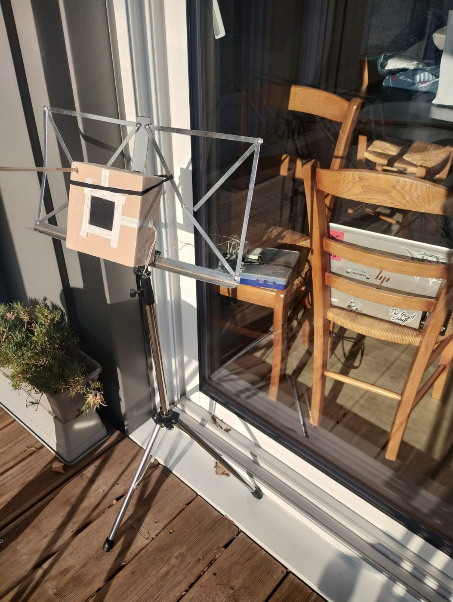
  <br><em>The finished sensor during an outdoor campaign: the brass cube sits behind a glass pane in the insulating block, and the Arduino kit records from inside.</em>
</p>

| Requirement | Target | What we achieved |
|---|---|---|
| Thermometer precision | ±0.03 °C | **±0.018 °C** |
| Heat capacity of the block, C<sub>T</sub> | ±3 % | **378.48 ± 5.37 J·kg⁻¹·K⁻¹** (1.3 %) |
| Solar irradiance | < 10 % uncertainty | **650 ± 31 W·m⁻²** and **887 ± 45 W·m⁻²** (≈ 5 %) |

📄 **Full reports:** [English](docs/reports/MINUTO_Final_Report_EN.pdf) · [Français](docs/reports/MINUTO_Rapport_Final_FR.pdf)

---

## Contents

1. [Repository layout](#repository-layout)
2. [How it works](#how-it-works)
3. [The thermometer](#1-the-thermometer)
4. [Calibration (étalonnage)](#2-calibration-étalonnage)
5. [Measuring the heat capacity C<sub>T</sub>](#3-measuring-the-heat-capacity-ct)
6. [Measuring the solar irradiance](#4-measuring-the-solar-irradiance)
7. [Getting started](#getting-started)
8. [Team](#team)

---

## Repository layout

```
.
├── code/
│   ├── fr/                      # original code, French comments and names
│   │   ├── arduino/
│   │   │   ├── thermistance_test/thermistance_test.ino
│   │   │   ├── etalonnage/etalonnage.ino
│   │   │   └── lecture_tension/lecture_tension.ino
│   │   └── python/
│   │       ├── enregistrement_etalonnage.py
│   │       ├── enregistrement_chauffe.py
│   │       └── trace_csv.py
│   └── en/                      # same code, translated to English
│       ├── arduino/
│       │   ├── thermistor_test/thermistor_test.ino
│       │   ├── calibration/calibration.ino
│       │   └── voltage_reading/voltage_reading.ino
│       └── python/
│           ├── record_calibration.py
│           ├── record_heating.py
│           └── plot_csv.py
├── data/                        # raw measurements (see data/README.md)
│   ├── 01_voltage_divider_test/
│   ├── 02_calibration/
│   ├── 03_heating_wire/
│   └── plots/
├── docs/
│   ├── reports/                 # final reports (EN + FR)
│   └── images/                  # photos and figures used in this README
├── requirements.txt
└── README.md
```

The French and English folders contain the same programs:

| Purpose | Arduino (FR / EN) | Python (FR / EN) |
|---|---|---|
| First thermistor test (voltage divider + Beta model, compared with TMP117) | `thermistance_test` / `thermistor_test` | – |
| Calibration: send `Ug, Ul, Uref, T_TMP117, t` every second | `etalonnage` / `calibration` | `enregistrement_etalonnage.py` / `record_calibration.py` |
| Heating-wire and solar runs: send `t, Uref, Ug, Uth, Ufil` every 0.5 s | `lecture_tension` / `voltage_reading` | `enregistrement_chauffe.py` / `record_heating.py` |
| Plot Ug against temperature from a saved CSV | – | `trace_csv.py` / `plot_csv.py` |

---

## How it works

The sensor is treated as a black body. Its heat balance is

```math
m\,C_T\,\frac{dT}{dt} = -\sigma S_0\,(T^4 - T_{ext}^4) - h S_0\,(T - T_{ext}) + F_0(t)\,S_e
```

where $`S_e = S_0\cos\theta`$ is the surface facing the sun. If we know the block's heat capacity $`C_T`$ and its losses, then **measuring $`T(t)`$ precisely is enough to recover the solar flux $`F_0(t)`$**. So the project has three stages:

1. Build and **calibrate** a thermometer that can resolve a few hundredths of a degree.
2. Measure the **heat capacity $`C_T`$** of the brass block with a known electrical heating power.
3. Expose the block to the sun and **invert the model** to get $`F_0`$.

---

## 1. The thermometer

An **NTC thermistor** sits in a **Wheatstone bridge**. The bridge outputs a voltage relative to a reference instead of an absolute one, which removes the offset. An **op-amp stage** then amplifies that small difference, and the **Arduino UNO R4** digitizes it.

<p align="center">
  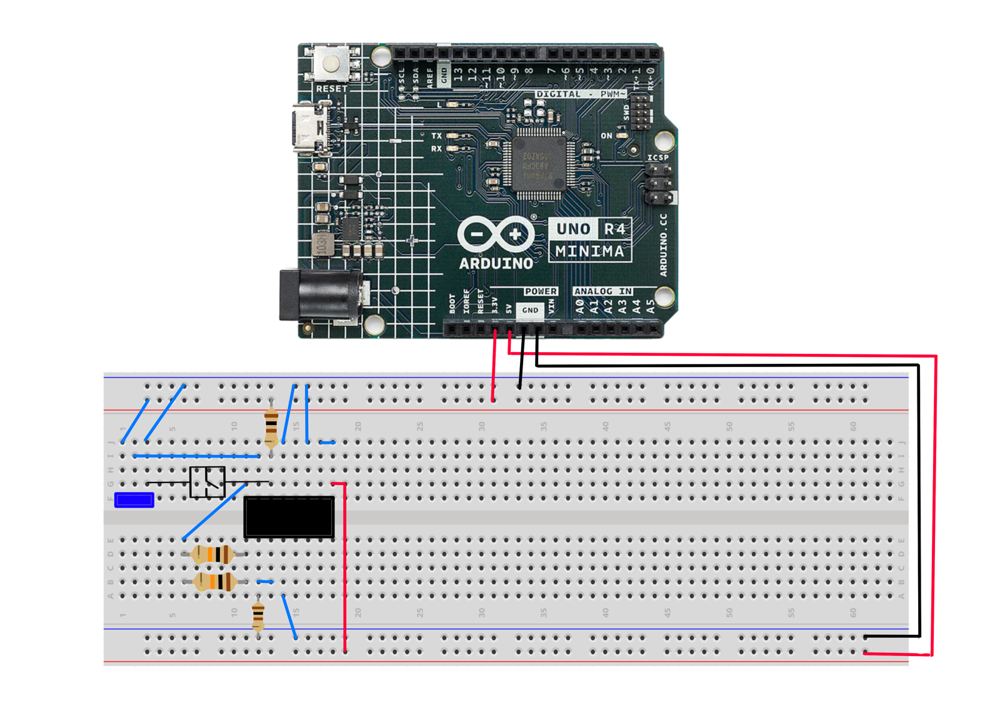
  <br><em>Circuit schematic (bridge + amplification).</em>
</p>

<table>
  <tr>
    <td>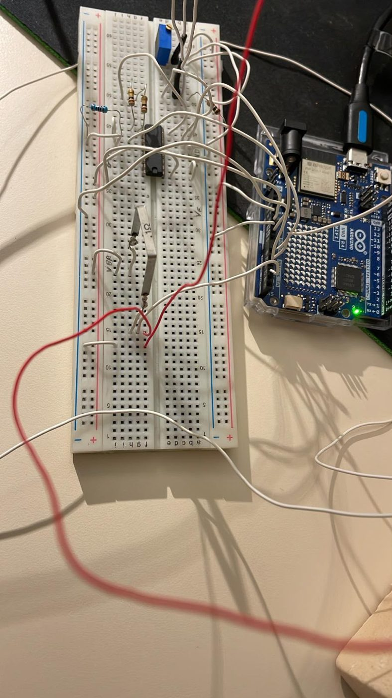</td>
    <td>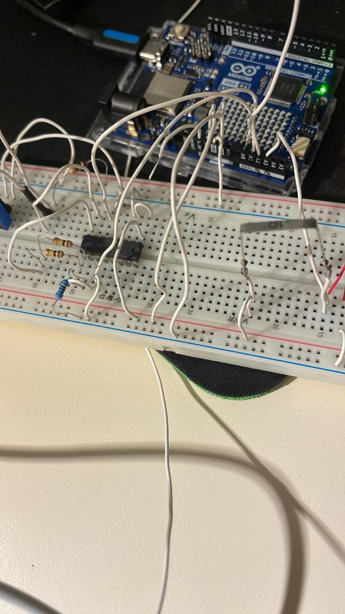</td>
    <td>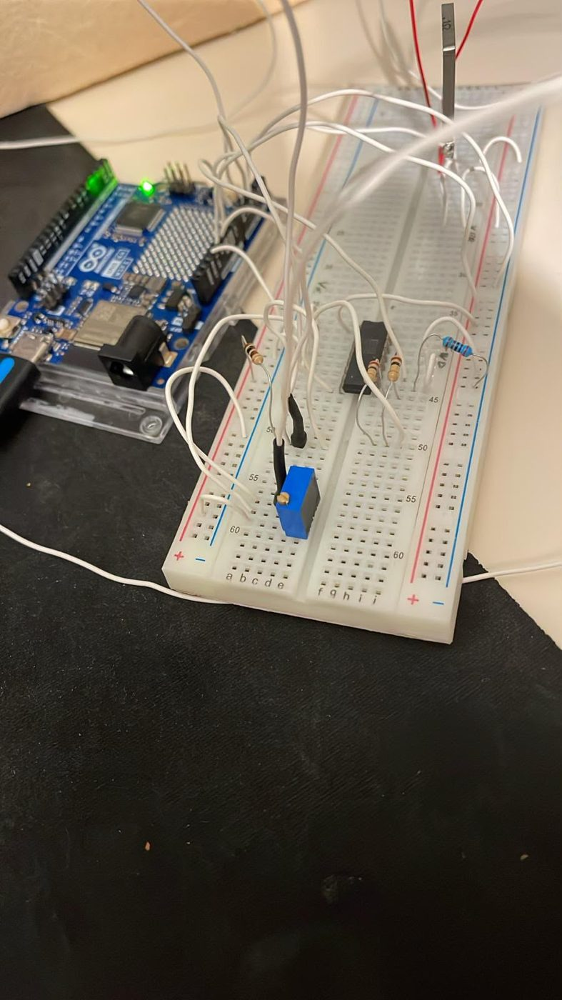</td>
  </tr>
  <tr>
    <td align="center"><em>Top view: the bridge and op-amp next to the Arduino UNO R4.</em></td>
    <td align="center"><em>Op-amp and bridge resistors, wired to the analog inputs.</em></td>
    <td align="center"><em>The blue multi-turn trimmer potentiometer on the bridge.</em></td>
  </tr>
</table>

**Why this design**

- A plain voltage divider cannot reach 0.03 °C with an 11-bit reading, so the bridge output has to be amplified.
- The analog inputs accept at most 4.7 V, and the op-amp saturates at **3.70 V**. We chose a gain of **≈ 4.5** so that Ug stays between 0 and 3.70 V.
- The thermistor voltage *rises* as the temperature *drops*. The op-amp input is $`U_{ref} - U_{th}`$, so $`U_{ref}`$ was set to the thermistor voltage at **2.30 °C**. That makes 2.30 °C the bottom of the range, which beats the required T<sub>min</sub> ≤ 5 °C.
- **Stable reference.** During some measurements, $`U_{ref}`$ fluctuated in ways that made no sense and corrupted the acquisitions. In the final version, $`U_{ref}`$ comes straight from the Arduino's DAC instead of the supply rail:

  ```cpp
  analogWriteResolution(12);
  analogWrite(A0, 1828);
  ```

- **11-bit reading.** `analogReadResolution(11)` only returned zeros on our board. The sketches therefore read 12 bits and shift right by one bit (`value >> 1`), which gives 2047 levels.

---

## 2. Calibration (étalonnage)

The circuit outputs a voltage $`U_g`$, not a temperature. Calibration finds the law linking the two, by comparing our thermometer with a **reference probe, the TMP117** (accuracy ±0.1 °C).

### Protocol

1. **Same temperature for both probes.** The thermistor and the TMP117 measure the same environment.
2. **Sweep the whole range.** The setup was cooled down to about **4 °C**, then left to warm up slowly to about **30 °C** while recording, over roughly two hours. This covers the whole useful range of the sensor in a single run.
3. **Record.** The [`calibration.ino`](code/en/arduino/calibration/calibration.ino) sketch ([`etalonnage.ino`](code/fr/arduino/etalonnage/etalonnage.ino) in French) sends one line per second, `Ug, Ul, Uref, T_TMP117, t`. [`record_calibration.py`](code/en/python/record_calibration.py) saves these lines to a CSV and plots Ug(t), T(t) and Ug(T).

<table>
  <tr>
    <td>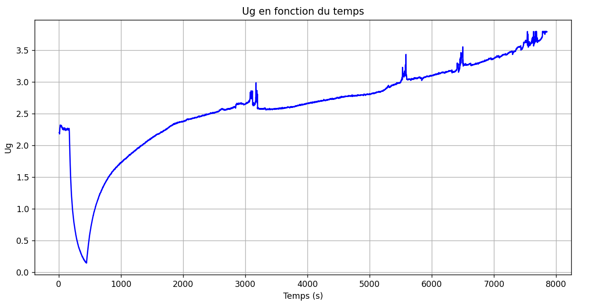</td>
    <td>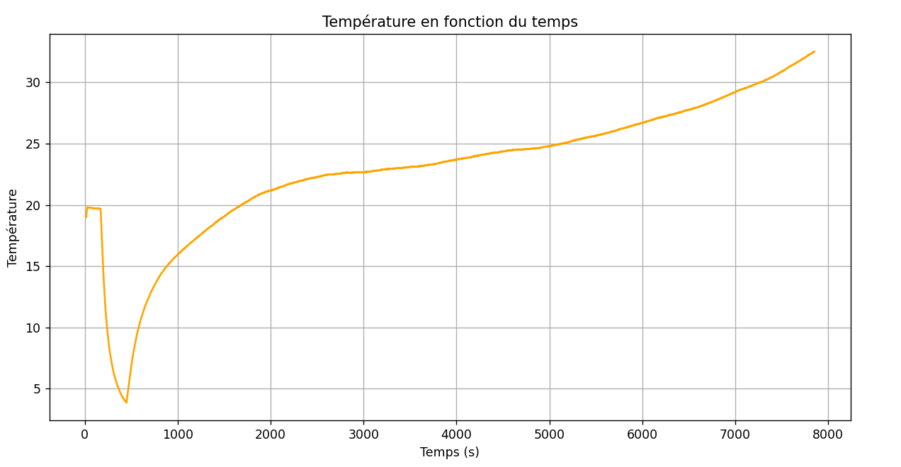</td>
  </tr>
  <tr>
    <td align="center"><em>Ug over time: the dip is the cool-down, then a slow rise. Note the small jumps around 3000, 5500 and 6500 s.</em></td>
    <td align="center"><em>Reference temperature (TMP117) over the same run.</em></td>
  </tr>
</table>

4. **Clean.** We removed the points that belong to the sudden **jumps in Ug**, because they do not come from a real temperature change.
5. **Fit with Monte Carlo.** We fit a straight line $`U_g = a\,T + b`$. To propagate the uncertainties, the fit is repeated **n = 1000 times**, and each repetition adds random noise to every point:
   - on T: $`u(T) = 0.1`$ °C (TMP117 accuracy)
   - on Ug: $`u(U_g) = \dfrac{V_{ref}}{N_q} = \dfrac{4.86}{2047} \approx 2.37`$ mV (one 11-bit ADC step)

   The mean and standard deviation of the 1000 values of a and b give the coefficients and their uncertainties.

### Result

```math
a = (0.1257 \pm 0.0001)\ \text{V·°C}^{-1} \qquad b = (-0.2890 \pm 0.0017)\ \text{V}
```

so a reading is converted to a temperature with

```math
T = \frac{U_g - b}{a}
```

<table>
  <tr>
    <td>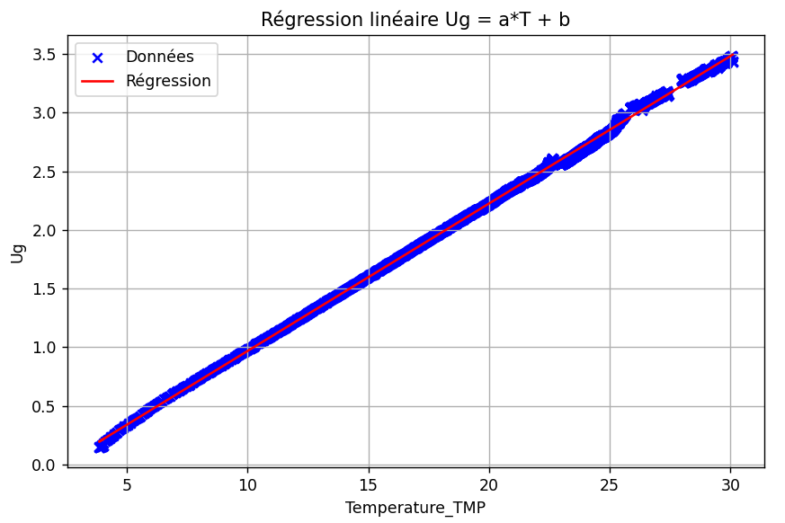</td>
    <td>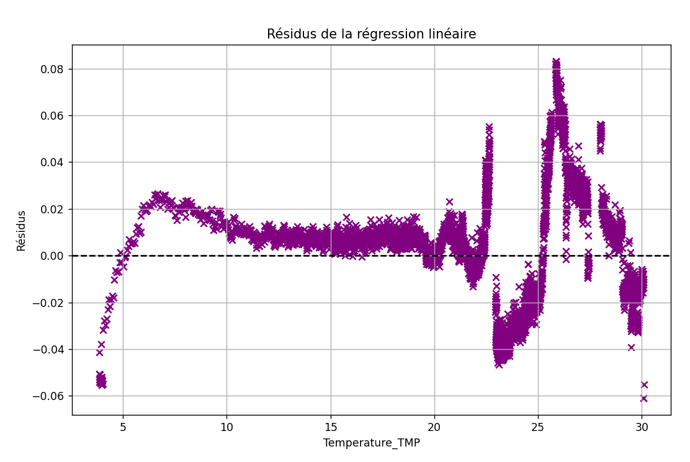</td>
  </tr>
  <tr>
    <td align="center"><em>Ug against T<sub>TMP117</sub>, with the fitted line.</em></td>
    <td align="center"><em>Residuals of the regression.</em></td>
  </tr>
</table>

<p align="center">
  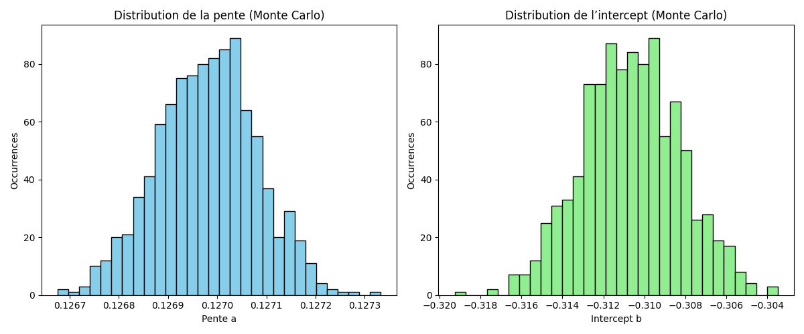
  <br><em>Distributions of the slope a and the intercept b over the 1000 Monte Carlo draws.</em>
</p>

- **Effective range: 3.85 °C → 30.09 °C** (above about 31.8 °C the op-amp saturates)
- **Precision: ±0.018 °C**, about one ADC step (2.37 mV) divided by the slope a, and below the 0.03 °C requirement ✅

Some example calibration runs are in [`data/02_calibration`](data/02_calibration). Plot any of them with:

```bash
python code/en/python/plot_csv.py data/02_calibration/mesures0.csv
```

---

## 3. Measuring the heat capacity C<sub>T</sub>

The block's heat capacity comes from **Joule heating**. A heating wire inside the cube carries a current set by a 5 V supply. A shunt resistor R gives the current, so the heating power is

```math
P = U_{fil}\cdot I = \frac{U_{fil}\cdot U_{SH}}{R}
```

<table>
  <tr>
    <td width="50%">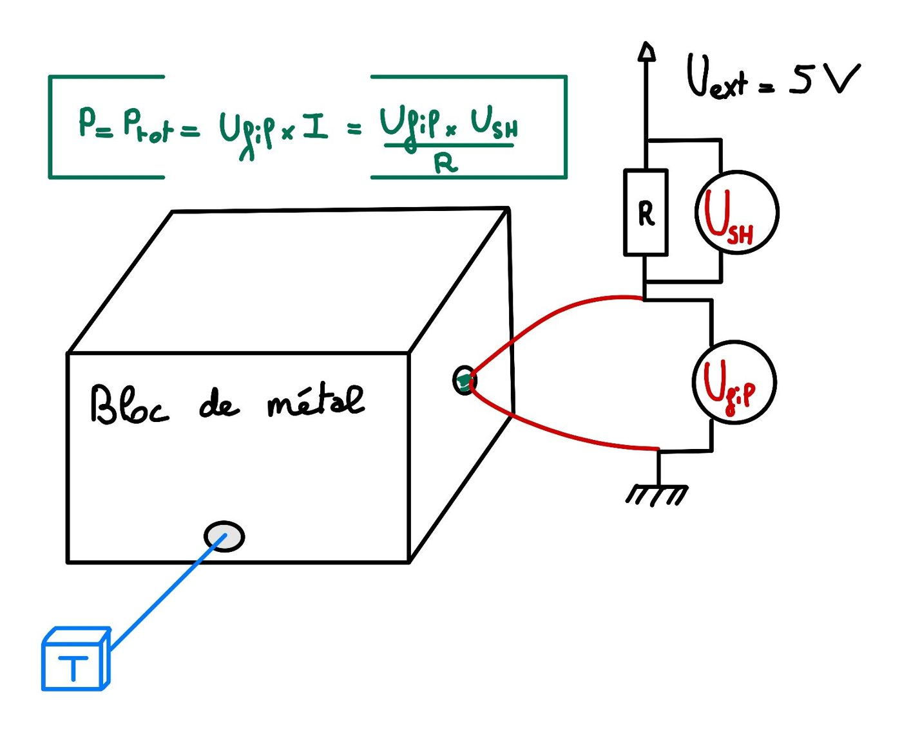</td>
    <td width="50%">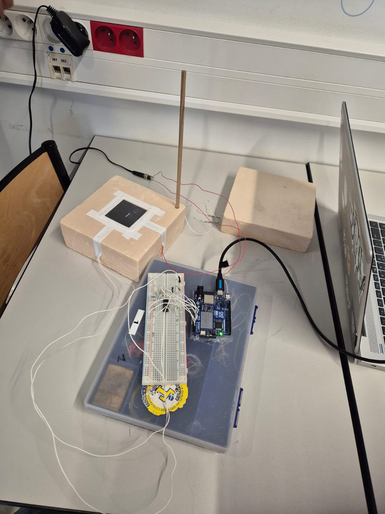</td>
  </tr>
  <tr>
    <td align="center"><em>Heating circuit: shunt R (voltage U<sub>SH</sub>) in series with the heating wire (voltage U<sub>fil</sub>), with the thermometer T on the block.</em></td>
    <td align="center"><em>In the lab: the cube inside its insulating block, the heating-wire leads (red) to the supply, and the acquisition kit.</em></td>
  </tr>
</table>

**Protocol, run in a cold environment.** The thermometer saturates around 31.8 °C, so starting from room temperature (~20 °C) would leave too little room for heating.

1. Leave the equipment and its insulating block in the cold for **1 hour** to stabilize.
2. Put the cube into its block and wait **15 more minutes**.
3. Start the acquisition ([`voltage_reading.ino`](code/en/arduino/voltage_reading/voltage_reading.ino) + [`record_heating.py`](code/en/python/record_heating.py)).
4. Connect the heating wire.

The temperature follows

```math
T(t) = T_{ext} + \frac{P}{\lambda_{eff}}\left(1 - e^{-\frac{\lambda_{eff}}{m C_T}t}\right)
```

The uncertainties on U<sub>fil</sub>, R and time were propagated with a **Monte Carlo simulation of 100 000 draws**:

```math
C_T = 378.48 \pm 5.37\ \text{J·kg}^{-1}\text{·K}^{-1}\quad(1.3\ \%)
```

This is very close to the textbook value for **brass (377 J·kg⁻¹·K⁻¹)** and well inside the 3 % target ✅

<p align="center">
  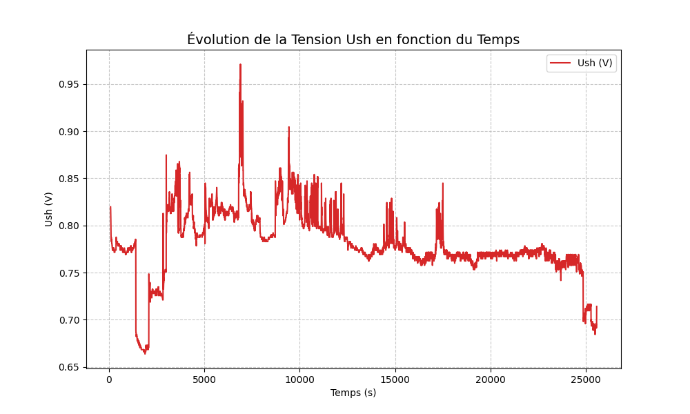
  <br><em>Shunt voltage U<sub>SH</sub> over the heating experiment, used to check that the heating power stayed stable.</em>
</p>

---

## 4. Measuring the solar irradiance

From the cooling (relaxation) phase we first measured the effective thermal conductance of the insulated system:

```math
\lambda_{eff} = (38.98 \pm 3.41)\times 10^{-3}\ \text{W·K}^{-1}
```

**Outdoor protocol**

1. **Acclimatize** the cube and its block outdoors, in the shade, for 1 hour.
2. **Assemble and seal:** cube into the block, then tape and a glass pane.
3. Put it on its stand with the **opposite face towards the sun**.
4. **Start the acquisition**, then turn the cube to face the sun.
5. Let it run for **about 1 hour** in steady, cloudless sunshine, without rotating it.

<table>
  <tr>
    <td width="50%"></td>
    <td width="50%">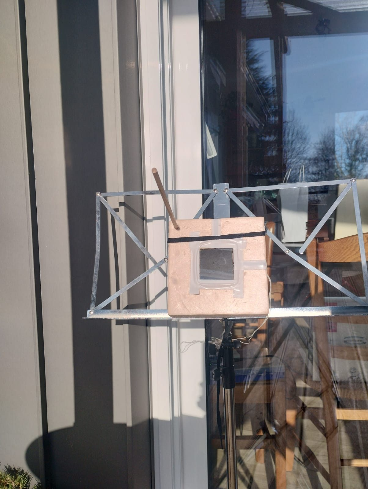</td>
  </tr>
  <tr>
    <td align="center"><em>Experiment 1, 26 December.</em></td>
    <td align="center"><em>Experiment 2, 28 December.</em></td>
  </tr>
</table>

### Results (Le Mans, December)

| Campaign | Analysis window | Mean flux F<sub>0</sub> (inverse model, Monte Carlo) |
|---|---|---|
| Friday 26 December, clear sky | 2000–2500 s (12:23–12:30) | **649.99 ± 31.25 W·m⁻²** |
| Sunday 28 December | 900–1250 s (12:47–12:53) | **886.87 ± 45.46 W·m⁻²** |

<table>
  <tr>
    <td>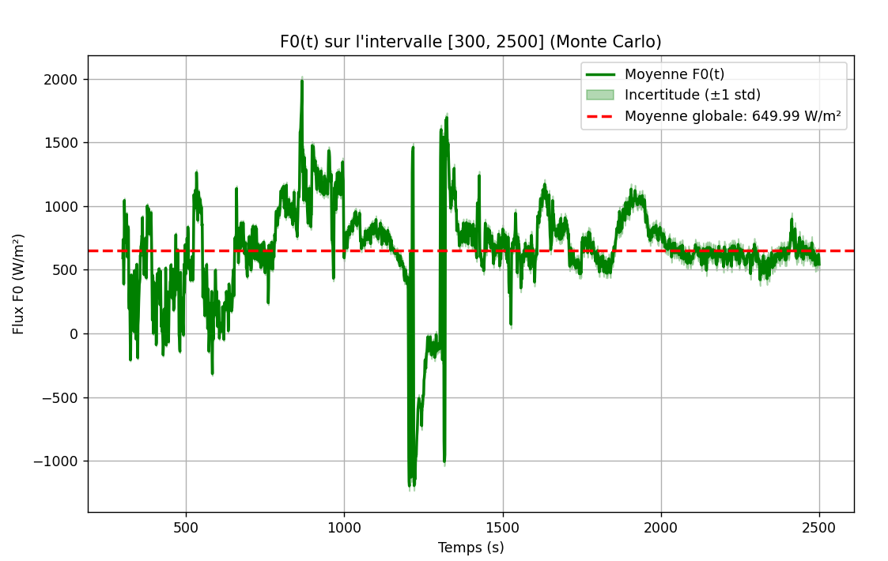</td>
    <td>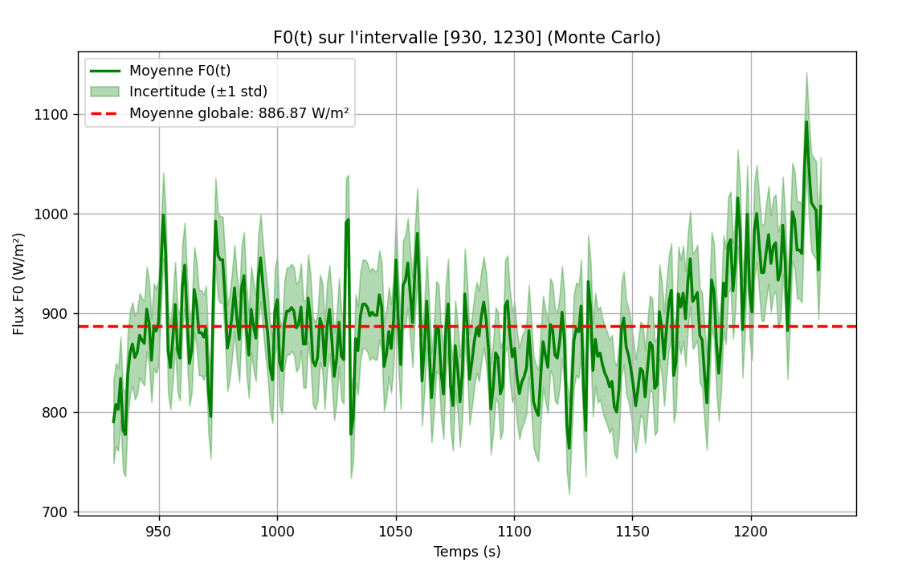</td>
  </tr>
  <tr>
    <td align="center"><em>F<sub>0</sub>(t), 26 December.</em></td>
    <td align="center"><em>F<sub>0</sub>(t), 28 December.</em></td>
  </tr>
</table>

### Comparison with the IMT Atlantique weather sensors (Nantes)

For each campaign we took the irradiance measured on the IMT Atlantique panels in Nantes over the same time window. Using the sun's elevation at that moment, we converted it into a **normal incident irradiance**:

| Campaign | Sun elevation | Panel irradiance | Normal irradiance E<sub>norm</sub> | MINUTO F<sub>0</sub> |
|---|---|---|---|---|
| 26 December | 18.67° | 267 W·m⁻² | 834 W·m⁻² | 650 ± 31 W·m⁻² |
| 28 December | 19.35° | 150 W·m⁻² | 452 W·m⁻² | 887 ± 45 W·m⁻² |

<table>
  <tr>
    <td>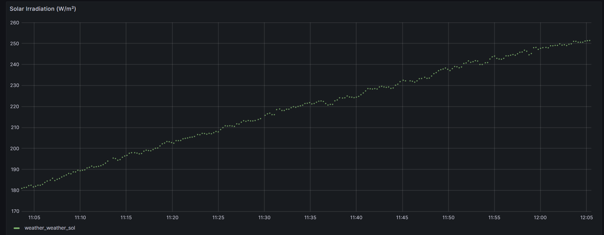</td>
    <td>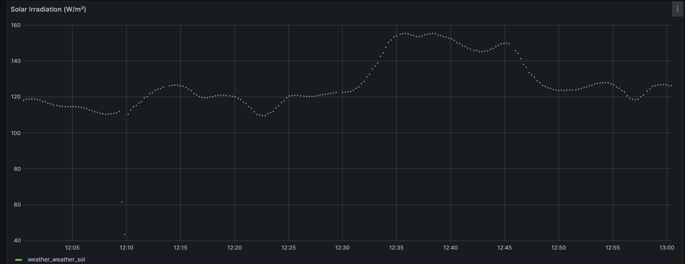</td>
  </tr>
</table>

The fluxes we reconstructed are **of the same order of magnitude** as the reference values, and the expanded uncertainty stays **below 10 %** ✅. Some differences are expected: our measurements were taken in Le Mans and the reference sensors are in Nantes, and outdoor conditions (wind, thin clouds) were not controlled. The rapid swings in F<sub>0</sub>(t) show how sensitive the sensor is to changes in irradiance and in heat exchange with the surroundings.

---

## Getting started

<p align="center">
  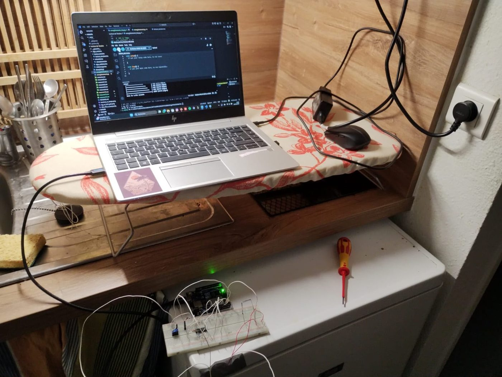
  <br><em>A recording session: the Arduino streams over USB and the Python script writes the CSV.</em>
</p>

### Hardware

- Arduino **UNO R4** (we used the WiFi version)
- NTC thermistor, bridge resistors, multi-turn trimmer potentiometer, op-amp, breadboard
- **SparkFun TMP117** reference temperature probe (I²C), for calibration
- Blackened brass cube, insulating block, glass pane
- For C<sub>T</sub>: heating wire, shunt resistor, 5 V supply

### Software

1. **Arduino IDE**, with the board package for the UNO R4 and the *SparkFun TMP117* library (Library Manager).
2. **Python 3**, then:
   ```bash
   pip install -r requirements.txt
   ```

### Running a measurement

1. Open the sketch you need in the Arduino IDE and upload it, from [`code/en/arduino`](code/en/arduino) or [`code/fr/arduino`](code/fr/arduino).
2. In the matching Python script, set `port` to your Arduino's port (`"COM5"` on Windows, `/dev/ttyACM0` on Linux) and `i` to the number of the output file.
3. Run it, for example:
   ```bash
   python code/en/python/record_calibration.py
   ```
4. Press **Ctrl + C** to stop. The CSV is saved, and the plots are shown (calibration) or saved as PNG (heating).

---

## Team

<p align="center">
  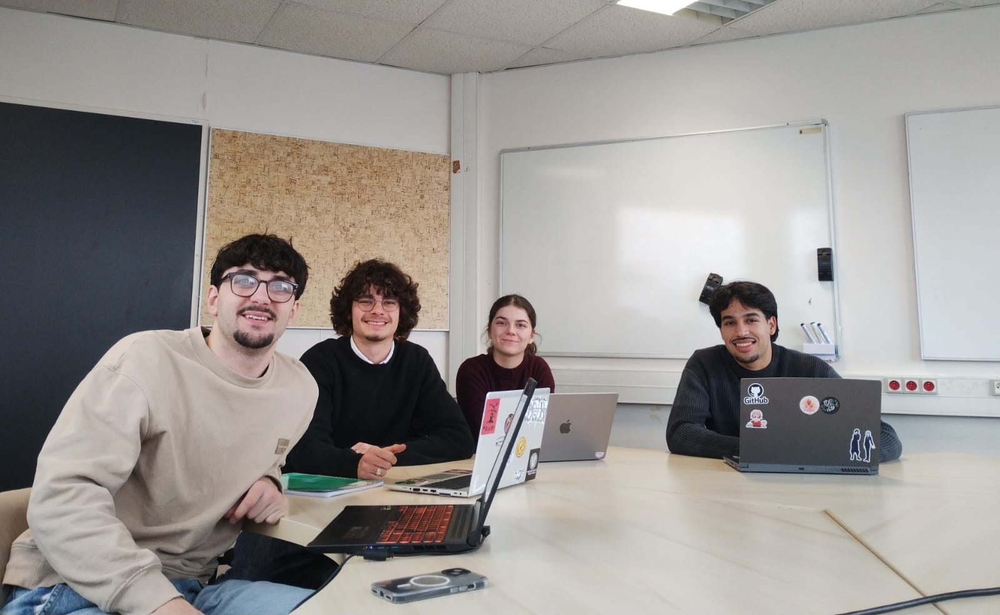
</p>

| Role | Member |
|---|---|
| Circuit lead | Pierre BERNARD |
| Code lead | Omar AMARA |
| Theory lead | Kellian BAILLEUL |
| Technical lead | Lucille AVIGNON |

The roles organized the work but did not create a hierarchy: decisions were taken together, and everyone worked across areas. The report covers the team organization ([section 5](docs/reports/MINUTO_Final_Report_EN.pdf)) and a reflection on the **environmental impact** of the project (section 6). That reflection covers embodied energy, replacing the polystyrene with cork or mycelium, recycling brass, and a future solar-powered version that logs to an SD card.

---

*IMT Atlantique · Bretagne-Pays de la Loire · École Mines-Télécom*
